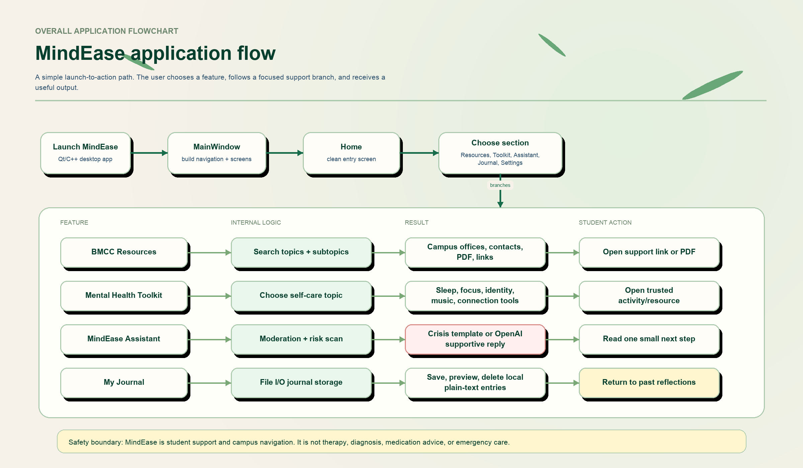
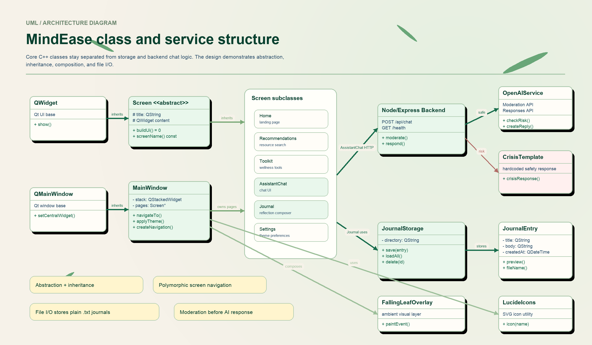

# MindEase Final Design Document

**Project:** MindEase - BMCC Wellness Companion  
**Course:** CSC211H Advanced Programming Techniques (Honors)  
**Student:** Phyo Thiha Oo  
**Semester:** Spring 2026  
**Platform:** C++17 / Qt 6 desktop application with a lightweight Node.js assistant backend

## 1. Project Summary

MindEase is a calm desktop wellness companion for Borough of Manhattan Community College students. The application helps students quickly find campus support resources, explore simple wellness tools, use a safe student-support assistant, and keep a private local journal.

MindEase is designed as a student-support and campus-navigation tool. It is not a therapist, doctor, counselor, diagnosis tool, treatment planner, medication guide, or emergency service. If a user expresses crisis language or immediate danger, the assistant stops normal coaching and returns a crisis-support response with 911, 988, and BMCC Counseling Center guidance.

## 2. Problem Statement

Students often need help but may not know which office, page, or resource to start with. BMCC has many support services, but students may feel stressed, overwhelmed, or unsure where to search first.

MindEase reduces that friction by organizing support around student needs instead of office names. A student can choose a topic such as study stress, finance, immigration, wellness, relationships, or career support, then receive curated contact information, links, and next steps.

## 3. Design Goals

- Keep the interface calm, clean, and easy to explore.
- Use simple navigation instead of overwhelming menus.
- Organize support by student needs and subtopics.
- Demonstrate C++ OOP concepts through clean class structure.
- Use file I/O for local journal storage.
- Keep the assistant lightweight, safe, and clearly limited.
- Avoid storing private journal data in a cloud database.
- Provide a polished Zen-inspired visual identity with soft green tones, gentle glow, and falling leaf animation.

## 4. Scope

### Included

- Home screen with clear entry points.
- BMCC resource finder with search for topics and subtopics.
- Mental Health Toolkit with self-care resource categories.
- MindEase Assistant chat with backend safety checks.
- Journal page with local save, preview, and delete.
- Settings for simple user preferences.
- Embedded local PDF resource support.
- Lucide icon-based UI instead of emoji-only visuals.
- Falling leaf overlay for the Zen visual style.

### Not Included

- User accounts.
- Cloud database storage.
- Medical diagnosis or treatment planning.
- Emergency response handling by the app itself.
- Replacing professional counseling or emergency services.

## 5. Core Features

### Home

The Home screen introduces MindEase with a simple message and direct buttons to the major sections. The design avoids sidebars and keeps the first screen minimal so the user can choose their path without visual clutter.

### BMCC Resources

The BMCC Resources page organizes campus help by need. Students can browse cards or search by topic/subtopic. The search algorithm matches both high-level categories and nested resource details.

Examples include:

- Exam and study stress.
- Finance and emergency support.
- Immigration support.
- Relationships and family.
- Health and wellness.
- Job and career resources.
- Digital education and free software support.

### Mental Health Toolkit

The toolkit provides low-risk wellness tools and resource links. It includes topics such as academic stress, mindfulness, connection and community, sleep, nutrition, music, identity care, and journaling.

This page is not clinical. It gives practical, student-friendly self-care suggestions and trusted external resources.

### MindEase Assistant

The assistant is a student wellness support chatbot. It helps users talk through stress, overwhelm, loneliness, homesickness, motivation, burnout prevention, and help-seeking.

The backend uses:

- OpenAI Moderation API first.
- Backend keyword/risk checks.
- Crisis template for high-risk input.
- OpenAI Responses API only when the message is considered safe.

The assistant tone is warm, calm, concise, and practical. It gives small next steps rather than long advice.

### My Journal

The journal lets students write private reflections. Entries are saved locally as plain text files using file I/O. Users can view past reflections and delete entries they no longer want to keep.

The journal is local-first. It does not require login, database setup, or cloud storage.

## 6. Overall Application Flowchart



The application begins with the Qt desktop launch, builds the main window and screens, then routes the user to one of four main support paths:

- BMCC Resources.
- Mental Health Toolkit.
- MindEase Assistant.
- My Journal.

Each path returns a concrete result: a support link, PDF, activity, assistant reply, or saved journal entry.

## 7. UML / Architecture Diagram



The design separates UI screens, models, storage, animation, icons, and backend assistant logic.

The main object-oriented structure is:

- `QWidget` is the Qt UI base class.
- `Screen` is an abstract base class for pages.
- `Home`, `Recommendations`, `Toolkit`, `AssistantChat`, `Journal`, and `Settings` are screen subclasses.
- `MainWindow` owns and navigates between screen objects.
- `JournalStorage` handles file I/O.
- `JournalEntry` represents saved journal data.
- `AssistantChat` communicates with the Node/Express backend.
- `FallingLeafOverlay` handles the ambient visual animation.
- `LucideIcons` centralizes icon rendering.

## 8. Object-Oriented Design

### Abstraction

The `Screen` class acts as an abstract base for all app screens. It defines common behavior while allowing each page to implement its own interface.

### Inheritance

Each major page inherits from `Screen`, allowing the app to treat all pages consistently while keeping each page's implementation separate.

### Polymorphism

`MainWindow` can manage multiple screen objects through the shared `Screen` interface. This allows page switching without hardcoding each screen's internal behavior into the main window.

### Encapsulation

Journal storage logic is isolated in `JournalStorage`. Journal data is represented by `JournalEntry`. UI screens do not need to know the full details of file creation, loading, or deletion.

### Composition

`MainWindow` owns the screen pages and visual helpers. The UI is built from smaller focused classes rather than one large file.

## 9. File I/O Design

Journal entries are saved as local plain text files. This demonstrates file I/O while keeping the project simple and understandable.

Typical journal flow:

1. User writes a title and body.
2. `Journal` sends the data to `JournalStorage`.
3. `JournalStorage` creates a safe local filename.
4. Entry content is written to a `.txt` file.
5. Past entries are loaded back into the journal list.
6. User can preview or delete entries.

This approach avoids a database and supports the project goal of a simple local-first wellness tool.

## 10. Assistant Safety Design

The assistant backend follows a safety-first flow:

1. Qt frontend sends a user message to `/api/chat`.
2. Express backend validates the request.
3. OpenAI Moderation API checks the message.
4. Backend risk logic scans for crisis language.
5. If risk is detected, the backend returns a hardcoded crisis-support template.
6. If safe, the backend sends the message to the OpenAI Responses API.
7. The frontend displays the returned response.

The crisis response is intentionally hardcoded so urgent language does not depend on a generated model answer.

## 11. UI / Visual Design

MindEase uses a calm Zen-inspired visual system:

- Cream and soft green background.
- Rounded white and mint cards.
- Subtle green borders and shadows.
- Minimal navigation.
- Lucide icons instead of emoji-heavy UI.
- Falling abstract bamboo leaves for gentle motion.
- Light and Zen Night visual modes.

The goal is to make the app feel calm and organized without making it look clinical or crowded.

## 12. Technology Stack

| Layer | Technology |
|---|---|
| Desktop UI | C++17, Qt 6 Widgets |
| Navigation | `QMainWindow`, `QStackedWidget`, custom `Screen` subclasses |
| Local Storage | Qt file I/O, plain text files |
| Backend | Node.js, Express |
| AI Safety | OpenAI Moderation API plus backend risk logic |
| AI Reply | OpenAI Responses API |
| Icons | Lucide SVG icons |
| Visual Effects | Custom falling leaf overlay |
| Build System | qmake |

## 13. Project Structure

```text
MindEase/
├── app/
│   ├── main.cpp
│   └── mainwindow.h / mainwindow.cpp
├── backend/
│   ├── server.js
│   ├── routes/chat.js
│   ├── services/openai.js
│   ├── prompts/mindeaseSystem.js
│   └── templates/crisisResponse.js
├── core/
│   ├── screen.h / screen.cpp
│   ├── fallingleafoverlay.h / fallingleafoverlay.cpp
│   └── lucideicons.h / lucideicons.cpp
├── docs/
│   └── assets/diagrams/
├── models/
│   └── journalentry.h / journalentry.cpp
├── resources/
│   ├── resources.qrc
│   └── 2025-KYR-Final-01.13.202592.pdf
├── screens/
│   ├── assistantchat.h / assistantchat.cpp
│   ├── home.h / home.cpp
│   ├── journal.h / journal.cpp
│   ├── recommendations.h / recommendations.cpp
│   ├── settings.h / settings.cpp
│   └── toolkit.h / toolkit.cpp
├── storage/
│   └── journalstorage.h / journalstorage.cpp
├── MindEase.pro
└── README.md
```

## 14. Limitations and Future Improvements

- The assistant requires a local backend and a valid OpenAI API key.
- Journal entries are local text files, so they are not synced across devices.
- Resource links may need future updates if BMCC webpages change.
- The assistant is intentionally limited to low-risk student support.
- A future version could add optional export/import for journal entries.
- A future version could package the backend startup more smoothly for non-technical users.

## 15. Final Summary

MindEase demonstrates CSC211H course concepts through a complete student-centered application. It uses C++ OOP design, Qt UI development, file I/O, modular architecture, and a safe AI-assisted backend. The final product is a personal BMCC Honors Project focused on helping students find support more calmly and efficiently.
